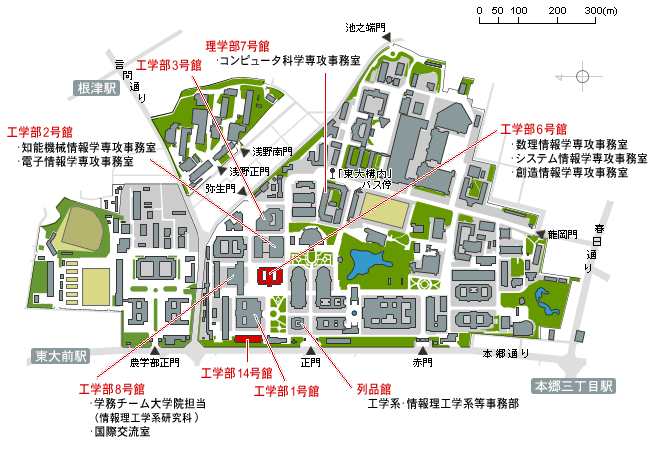
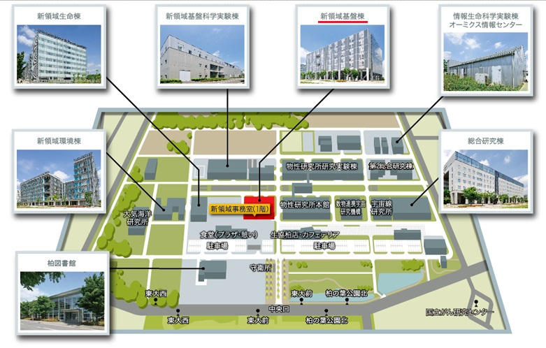

## 本郷キャンパス

〒113-8656 東京都文京区本郷 7-3-1

- 篠田教授室
  - 工学部6号館 2階 241号室 (電話&Fax: 03-5841-6926 | 内線: 26926)
- 牧野准教授室
  - 工学部6号館 2階 241号室 (電話&Fax: 03-5841-6900 | 内線: 26900)
- 学生居室
  - 工学部14号館 6階 622号室 (電話: 03-5841-6368 | 内線: 26368)
- 実験室
- 工学部14号館 6階 605号室 (電話: 03-5841-7433 | 内線: 27433)

## 柏キャンパス

〒277-8561 千葉県柏市柏の葉 5-1-5

- 篠田教授室
  - 新領域基盤棟 3階 3H9 (電話&Fax: 04-7136-3900 | 内線: 63900)
- 牧野准教授室
  - 新領域基盤棟 3階 3H7 (電話&Fax: 04-7136-3912 | 内線: 63912)
- 学生居室
  - 新領域基盤棟 3階 3E3 (電話&Fax: 04-7136-3777 | 内線: 63777)
  - 新領域基盤棟 3階 3E7 (電話: 04-7136-3777 | 内線: 63777)
- 実験室
  - 新領域基盤棟 3階 3F2 (電話: 04-7136-3777 | 内線: 63777)
