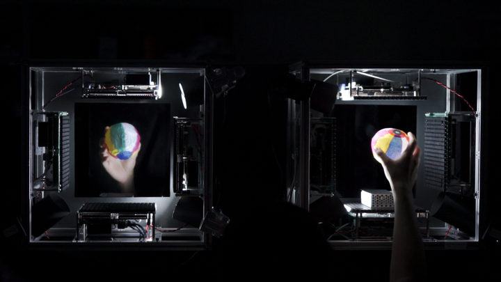

import MdxLightboxImage from "../../components/MdxLightboxImage.astro";
import fig1 from "../../assets/research-topics/haptoclone/scene_AUTD_4.png";
import fig2 from "../../assets/research-topics/haptoclone/AIP_sharpen.png";
import fig3 from "../../assets/research-topics/haptoclone/haptoclone_4_720.jpg";
import fig4 from "../../assets/research-topics/haptoclone/haptoclone_2_720.jpg";
import fig5 from "../../assets/research-topics/haptoclone/push.png";

_Demonstrated at SIGGRAPH 2015 Emerging Technologies and SUI 2015_

-   [Yasutoshi Makino, Yoshikazu Furuyama, Seki Inoue, Hiroyuki Shinoda: HaptoClone (Haptic-Optical Clone) for Mutual Tele-Environment by Real-time 3D Image Transfer with Midair Force Feedback, Proceedings of the 2016 CHI Conference on Human Factors in Computing Systems, pp. 1980-1990, San Jose Convention Center, San Jose, CA, USA, May 7–12, 2016.](https://dl.acm.org/citation.cfm?id=2858481&CFID=614333895&CFTOKEN=28636804)  ([Draft pdf](https://drive.google.com/file/d/1YzvpnkSgJ6GOutqeWQuOyKbgMrS19LiV/view?usp=sharing))

Main Contributors to the demo:  Yoshikazu Furuyama & Seki Inoue
Cooperators:  Keisuke Hasegawa, Koji Tanaka, Mitsuru Ito, Honglin Du
Supervisors:  Hiroyuki Shinoda & Yasutoshi Makino

Keywords: telehaptic communications, mid-air haptics, haptic holography, teleexistence, telepresense, airborne ultrasound tactile display, passive lightfield mirrors

Haptoclone (Haptic & optical clone) is a revolutionary interactive system producing haptic and optical clone image in mid-air. Two users apart from each other can touch each other with unaided eyes and bare hands.

This system has two workspaces apart from each other and the two workspace fields are virtually “superimposed” optically and haptically. The lightfield and forcefield of each workspace are cloned and forwarded to the other. A user in a workspace see the clone images of the objects existing in the other workspace. When a real object in a workspace is in contact with a clone image, the contact force is given to both the real object and original (real) object of the clone.

The system concentrates ultrasound energy at the intersections of the real and clone objects, which creates pressure to the real objects. If the “real object” is your finger, you feel contact force from the 3D clone object by the ultrasonic radiation pressure. At the same time, the same forces are applied to the original real object (of the clone) in the other workspace. The posture and the shape of the hand can be arbitrary.

The difference of Haptoclone interaction from actual contact is the displayed force is limited to about 100mN per square centimeter or less and the value is decided arbitrarily. Besides, the force direction is basically normal to the surface. But produced contact positions and areas are faithfully controlled on the object, which can produce realistic tactile sensation in some classes of contact.

It realizes various telehaptic experiences. Though a literal “handshake” is impossible since the produced force is weak, it is possible to stroke the hand of the other side and lightly touch each other freely at arbitrary parts of the hand, sharing the haptic sensation. Stroked by a clone hand, you feel existence of multiple fingers as well as where you are touched. In some modified manners, haptic communication as a handshake and high-fived can be achieved.

**Technical Details**

**To copy optical light field**, a pair of micro mirror arrays is aligned. The micro mirrors symmetrically reflect the light field coming from one side to the other. When we use the two micro mirror arrays and align them as shown in Fig 1, the object at A is optically cloned to the position B and C. As the same way, human standing at C side is copied to the A side simultaneously. We employ commercially available mirror array named “Aerial Imaging Plate” (AIP, Asukanet Co. Ltd.).

<MdxLightboxImage
    src={fig1}
    alt="Passive Lightfield Forwarding"
    width={320}
    caption="Fig 1. Passive Lightfield Forwarding"
/>

<MdxLightboxImage
    src={fig2}
    alt="Forwarded Image with depth of field"
    width={320}
    caption="Fig 2. Forwarded Image with depth of field"
/>

**To copy haptic force field**, we use ultrasonic haptic holography technique[1]. By holographic synthesis of ultrasonic field, volumetric acoustic potential field can be reproduced and that cause radiation force to objects in the peer workspace. The ultrasonic phased arrays which surround each workspace can produce omni-directional and volumetric force and invoke haptic sensation to user skin. This system equips 1992 ultrasonic transducers in total. The shapes in the workspaces are measured by infrared depth sensor and represented as point clouds. The point clouds are exchanged each other over UDP/IP protocols. Each peer calculates the collisions between own point clouds and peer’s point clouds and reproduces reaction forces between real objects in the workspace and peer’s virtual objects.

\[1\] Seki Inoue, Yasutoshi Makino, Hiroyuki Shinoda: Active Touch Perception Produced by Airborne Ultrasonic Haptic Hologram, Proc. 2015 IEEE World Haptics Conference (WHC), pp.362-367, 2015.

<MdxLightboxImage
    src={fig3}
    alt="Collisions between real balloon and virtual balloon"
    width={320}
    caption="Fig 3. Collisions between real balloon and virtual balloon"
/>

<MdxLightboxImage
    src={fig4}
    alt="Interaction between virtual cube and real hand"
    width={320}
    caption="Fig 4. Interaction between virtual cube and real hand"
/>

<MdxLightboxImage
    src={fig5}
    alt="Force field created with virtual finger image"
    width={320}
    caption="Fig 5. Force field created with virtual finger image"
/>

Our system provides following new experiences for users.

1. The people facing our system are optically copied to the other side without any time delay by using the passive lightfield mirrors.
1. A user can see both their own hand and the other’s cloned body in the same coordinate. The position and the timing of the clone image is perfectly synchronized to original motion.
1. Tactile feedback can be given when they virtually touch each other. The tactile feedback is given in mid-air by using a phase-controlled ultrasound array. The stimulation positions are precisely controlled.

Our system enables users to communicate with each other through haptics in real time with optical clone image.
