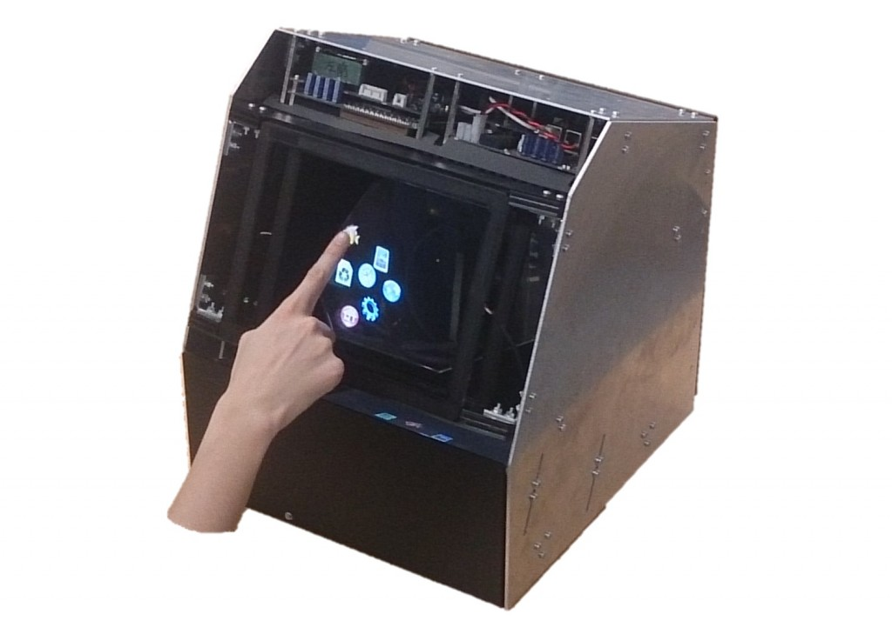

import PublicationRef from "../../components/PublicationRef.astro";

The system enables interaction with a floating image with touching sensation, i.e. tactile feedback. The tactile feedback is presented onto a fingertip by transmitting focused ultrasound superposed on the floating image. This scheme allows for touch interaction as if pantomiming on the floating image. The liberation from a physical panel extends the use of touch interface to such situations as cooking or medical operation, where otherwise hands get smeared by a panel or the panel gets smeared by the hands.

<iframe width="560" height="315" src="https://www.youtube.com/embed/uARGRlpCWg8?si=-1L0yCe1pSrp9Bz2" title="YouTube video player" frameborder="0" allow="accelerometer; autoplay; clipboard-write; encrypted-media; gyroscope; picture-in-picture; web-share" referrerpolicy="strict-origin-when-cross-origin" allowfullscreen></iframe>

1. <PublicationRef refId="monnai-2014-haptomime" />
