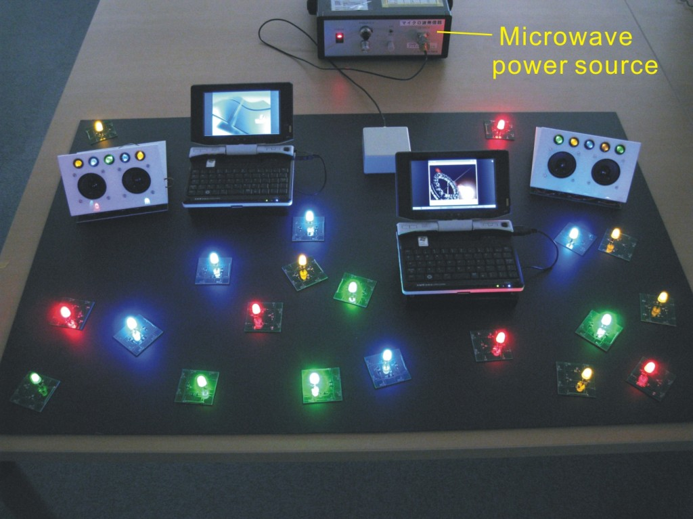

import PublicationRef from "../../components/PublicationRef.astro";

薄いシート内を伝播する電磁波によって情報と電力を伝送するシステムを研究しています。生活環境での安全なワイヤレス電力伝送、無線と干渉しない高速信号伝送などの技術を確立し、ワイヤレス・バッテリーレスの新しい情報環境を提案していきます。また、微小なセンサや機能部品を大面積の柔軟体に分布・連携動作させる技術を確立し、ロボットの人工皮膚やウエアラブルコンピューティングなどに応用します。

## 主な研究成果

1. <PublicationRef refId="noda-2011-selective" />
1. <PublicationRef refId="nakatsuma-2008-two-dimensional" />
1. <PublicationRef refId="shinoda-2010-flexible" />
1. <PublicationRef refId="shinoda-2007-surface" />
1. <PublicationRef refId="篠田-2007-素材表面に形成する高速センサネットワーク" />
