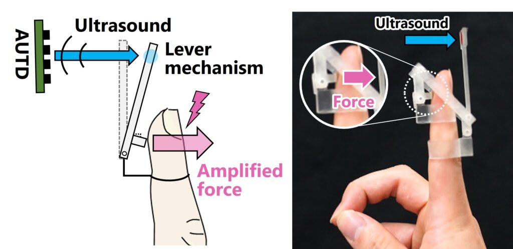

Left) Concept of ultrasound-driven passive haptic device. Right) Fabricated passive haptic device presenting 0.7 N force and 2- 30 Hz vibration to the fingerpad.

<iframe width="868" height="488" src="https://www.youtube.com/embed/CYVpGIibzNs" title="UltLever: Ultrasound-Driven Passive Haptic Actuator [IEEE ToH 2024]" frameborder="0" allow="accelerometer; autoplay; clipboard-write; encrypted-media; gyroscope; picture-in-picture; web-share" referrerpolicy="strict-origin-when-cross-origin" allowfullscreen></iframe>

超音波を集束させることで、音響放射力と呼ばれる力のスポットを空中に生成できます。我々は、この放射力をテコ機構で増幅し、より強い力をユーザーに提示するパッシブな触覚提示デバイスを開発しました。このデバイスはバッテリーや電子部品を全く含まないため、高い出力を持ちながらも軽量に作ることが出来ます。超音波の放射力は数十mN(数g)と弱いですが、その力は音速で提示されるため力学的パワーは高く取れます。このため、力と速度の比率を操作する機構であるテコを用いることで、強力な力と振動の両方を取り出すことができます。

ユーザーはまず、指先にパッシブ触覚デバイス、つまりテコを内蔵したプラスチック製のテコ機構を装着します。この装着されたテコに放射力を加え駆動することで、最終的に0.7 N(70 g)まで増幅された力が生まれ、ぐっと手指を押された感覚を与えることが出来ます。また、この放射力を変調することで、2~30 Hzの振動が提示できることも理論的・実験的に確認できました。

**Publication:**

Tao Morisaki, Takaaki Kamigaki, Masahiro Fujiwara, Yasutoshi Makino, and Hiroyuki Shinoda, “UltLever: Ultrasound-Driven Passive Haptic Actuator Based on Amplifying Radiation Force Using a Simple Lever Mechanism, ” IEEE Transactions on Haptics, Jan. 2024. [(Open Access) doi: 10.1109/TOH.2024.3363764](https://ieeexplore.ieee.org/document/10428111).

Tao Morisaki, Masahiro Fujiwara, Yasutoshi Makino, and Hiroyuki Shinoda, “Ultrasound-Driven Passive Haptic Actuator based on Amplifying Radiation Force using Simple Lever Mechanism,” SIGGRAPH ASIA 2022, Emerging Technologies.

[メタバース総研](https://metaversesouken.com/metaverse/university/#i-6)様にて紹介いただきました。
