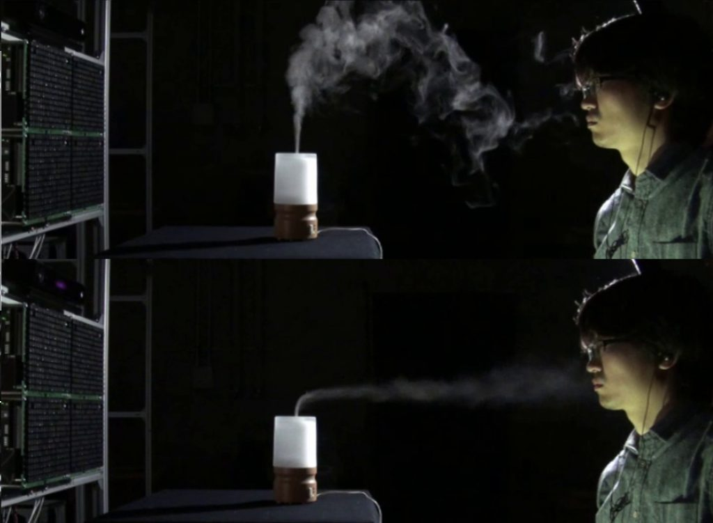

空中に超音波による「音響ベッセルビーム」を形成し、これに伴って発生する空気の流れ（音響流）により、環境中の匂いの空中運搬を行う技術を開発しました。
超音波のビームにより生成される気流は装置の遠方であっても狭い断面積を維持することができ、これにより局在的なにおいの提示を可能にしています。
匂いを発する物体は特定の容器に格納しなければならないといった制約なく、装置とは独立に自由に配置することができます。テーブルに置かれたカップに入ったコーヒーなどの生活空間における通常の物体に本技術は適用できます。
装置の配置の仕方によっては、ユーザーの鼻の近くにある物体のにおいを吹き飛ばすことで、匂いの除去を行うことも可能です。
本技術はあらかじめ用意された匂いの提示を行うだけでなく、ユーザーを取り巻く匂いの環境を制御することを可能にします。

[論文：Keisuke Hasegawa, Liwei Qiu, Akihito Noda, Seki Inoue, Hiroyuki Shinoda, “Electronically Steerable Ultrasound-Driven Narrow and Long Air Stream”, Applied Physics Letters, **111**, 064104 (2017)　（APL’s Editor’s Pickに選定）](http://aip.scitation.org/doi/10.1063/1.4985159)

[上記論文に関するweb記事: https://phys.org/news/2017-08-scientists-airflow-mid-air.html](https://phys.org/news/2017-08-scientists-airflow-mid-air.html)

[SIGGRAPH ASIA 2017で展示予定：紹介ページ](https://sa2017.siggraph.org/attendees/emerging-technologies?view=event&eid=113)
