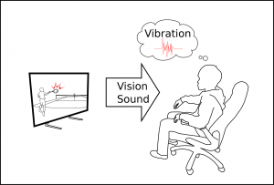
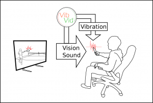

↓First person view of tennis playing

<iframe width="500" height="281" src="https://www.youtube.com/embed/dEwz3LjR1GA" title="VibVid: Vibration Estimation from Video" frameborder="0" allow="accelerometer; autoplay; clipboard-write; encrypted-media; gyroscope; picture-in-picture; web-share" referrerpolicy="strict-origin-when-cross-origin" allowfullscreen></iframe>

↓Back view of tennis playing

<iframe width="500" height="281" src="https://www.youtube.com/embed/jbtcNUZ8PK8" title="VibVid -Back View Video of Tennis" frameborder="0" allow="accelerometer; autoplay; clipboard-write; encrypted-media; gyroscope; picture-in-picture; web-share" referrerpolicy="strict-origin-when-cross-origin" allowfullscreen></iframe>

Fig1. Viewers can sometimes imagine how the vibrotactile stimuli are in the video.

図2. Video viewing improved by VibVid system.

[Kentaro Yoshida, Seki Inoue, Yasutoshi Makino, and Hiroyuki Shinoda, “VibVid: VIBration Estimation from VIDeo by using Neural Network,” in Proc. ICAT-EGVE 2017 – International Conference on Artificial Reality and Telexistence and Eurographics Symposium on Virtual Environments, Nov. 22-24, 2017, Adelaide, Australia.](http://dx.doi.org/10.2312/egve.20171336)

Kentaro Yoshida, Yuuki Horiuchi, Tomohiro Ichiyama, Seki Inoue, Yasutoshi Makino, and Hiroyuki Shinoda: Estimation of Racket Grip Vibration from Tennis Video Using Neural Network, IEEE Haptics Symposium 2018, WiP Poster B5 (Work-in-Progress Papers), 25-28 March, San Francisco, California, USA, 2018.

Kentaro Yoshida, Yuuki Horiuchi, Tomohiro Ichiyama, Seki Inoue, Yasutoshi Makino, and Hiroyuki Shinoda: Estimation and Presentation of Racket Grip Vibration with Tennis Video, IEEE Haptics Symposium 2018, Demo 5, 25-28 March, San Francisco, California, USA, 2018.
